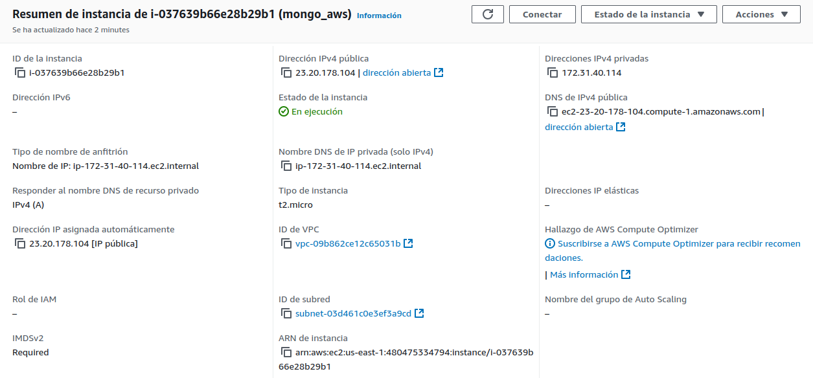
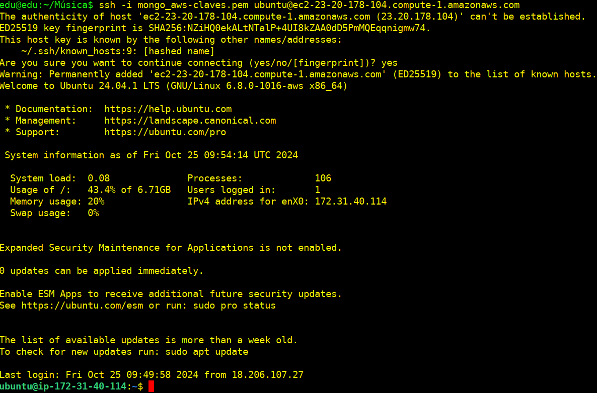
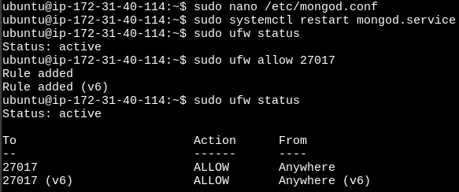
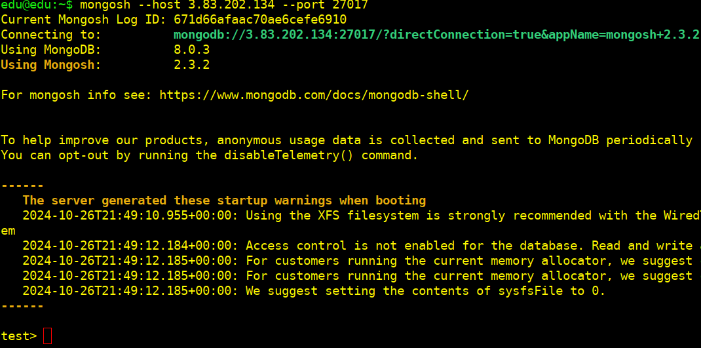
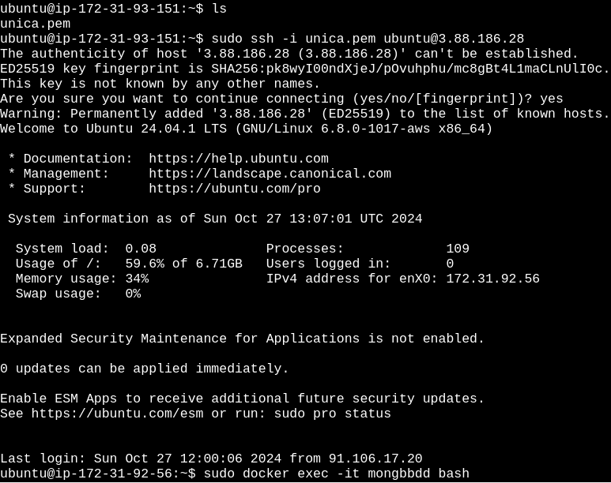
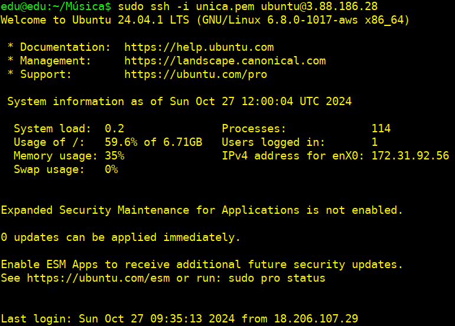
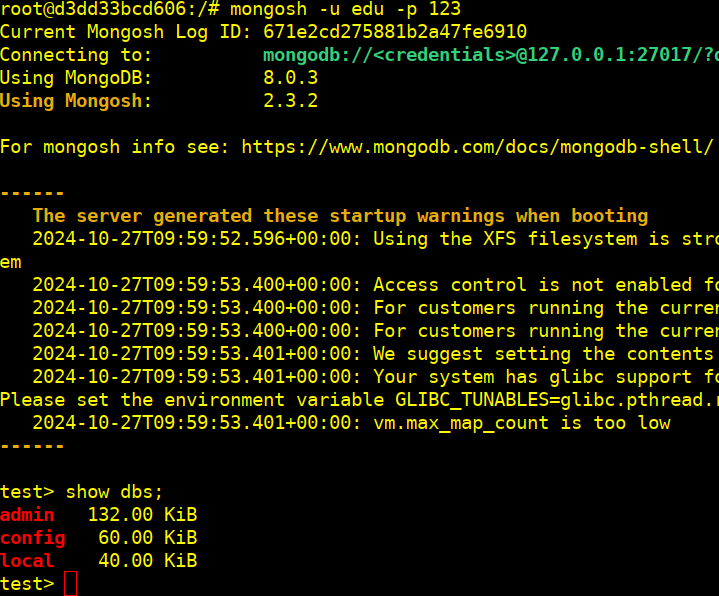

# Práctica 2.1: MongoDB (apt)

## Instalación y Configuración Avanzada de MongoDB

## Configuramos la primera instancia con ubuntu donde lo instalaremos (con apt install) mongoDB




**Verificamos la conectividad entre nuestro host y la MV AWS (apt):**

`ssh -i /ruta/a/clave .pem ubuntu@<ip-pública>`



**Análisis y selección del SGBD:**

<div style="text-align: justify">

Versión más adecuada para mi entorno como estudiante es la MongoDB Community Edition, por las siguientes razones:

- Es totalmente **gratuita y de código abierto,** lo que la hace ideal para estudiantes y proyectos académicos que no tienen recursos para pagar licencias.

- Es muy **estable y recibe actualizaciones** y parches de seguridad de forma regular. Esto garantiza que los estudiantes utilicen una versión sólida y segura, perfecta para aprender sin sacrificar la funcionalidad.

- Funciona en **múltiples sistemas operativos** (Windows, macOS y Linux), lo cual es útil para estudiantes que pueden estar trabajando con diferentes plataformas. La Community Edition también permite el uso de herramientas gratuitas como MongoDB Compass para la administración gráfica.

- Proporciona las **funcionalidades** clave de MongoDB, como las consultas flexibles de JSON, el soporte para índices y la capacidad de replicación. Esto permite a los estudiantes aprender conceptos fundamentales de bases de datos NoSQL, como la esca-labilidad.

</div>

### Instalación de MongoDB con `apt` en Ubuntu

#### Paso 1: Actualizar los paquetes e importar la clave pública

`sudo apt update`

`sudo apt-get install gnupg curl`

#### Paso 2: Importar la clave GPG de MongoDB

`curl -fsSL https://www.mongodb.org/static/pgp/server-8.0.asc | \
   sudo gpg -o /usr/share/keyrings/mongodb-server-8.0.gpg \
   --dearmor`

#### Paso 3: Creamos el archivo de lista para Ubuntu 24.04 (Noble)

`echo "deb [ arch=amd64,arm64 signed-by=/usr/share/keyrings/mongodb-server-8.0.gpg ] https://repo.mongodb.org/apt/ubuntu noble/mongodb-org/8.0 multiverse" | sudo tee /etc/apt/sources.list.d/mongodb-org-8.0.list`

#### Paso 4: Recargamos la BBDD de paquetes

`sudo apt-get update`

#### Paso 5: Instalamos la ultima versión estable

`sudo apt-get install -y mongodb-org`

#### Paso 6: Iniciar el servicio de MongoDB

`sudo systemctl start mongod`

**Si recibe un error similar al siguiente al iniciar** `mongod`

*Failed to start mongod.service: Unit mongod.service not found.*

**Primero ejecute el siguiente comando:**

`sudo systemctl daemon-reload`

**Luego ejecute nuevamente el comando de inicio anterior.**

#### Paso 7: Verificar el estado del servicio

`sudo systemctl status mongod`

**Podemos parar MongoDB:**

`sudo systemctl stop mongod`

**Para reiniciar MongDB:**

`sudo systemctl restart mongod`

#### Paso 8: Habilitar MongoDB para que inicie al arrancar el sistema

`sudo systemctl enable mongod`

#### Paso 9: Verificar la conexión a MongoDB

Para confirmar que MongoDB está funcionando correctamente, puedes ejecutar el cliente de MongoDB y ver si se conecta poder comenzar a utilizarlo:

`mongosh`


## Configuración de la conectividad de red en MongoDB (apt) para permitir conexiones remotas

### Editamos el archivo de configuración de MongoDB

`sudo nano /etc/mongod.conf`

#### Modificamos la opción `bindIp`

- Buscamos la línea que contiene `bindIp: 127.0.0.1` .Esta línea configura MongoDB para que solo escuche en la interfaz de localhost.
- Cambia el valor a `0.0.0.0` para permitir que MongoDB escuche en todas las interfaces de red:

```bash
net:
  port: 27017
  bindIp: 0.0.0.0
```


 > **Nota:** `bindIp: 0.0.0.0` permite que MongoDB acepte conexiones desde cualquier IP.

#### Reiniciamos MongoDB

`sudo systemctl restart mongod`

#### Configurar el Firewall (Opcional)

**Si tenemos el firewall habilitado, permitiremos el acceso al puerto `27017` para conexiones remotas:**

`sudo ufw allow 27017`



#### Verificar la conectividad remota

**Desde otra máquina intentaremos conectarnos al servidor de MongoDB usando 'mongosh' con la IP de la máquina donde MongoDB está instalado**

`mongosh --host <IP del servidor> --port 27017`


Si la conexión es correcta, MongoDB está configurado correctamente para conexiones remotas.

**En nuestro host**

- Comprobaremos en nuestro firewall que tenemos el puerto 27017 habilitado
- Instalaremos mogosdb-mongosh



## Gestión de cuentas de usuario y permisos

**Creamos un usuario que tenga permiso para conectarse desde la otra máquina**

`mongosh`

`test> use admin`

```j.son
db.createUser({
  user: "admin_user",
  pwd: "securePassword",
  roles: [
    { role: "root", db: "admin" }
  ]
});
```


Y hay que tener en cuenta de tener de cambiar el valor a `0.0.0.0` para permitir que MongoDB escuche en todas las interfaces de red:


### Conectaremos desde otra máquina (host) con el usuario administrador de MongoDB (apt)

`mongosh --host <IP_del_servidor> --port 27017 -u "admin_user" -p "securePassword" --authenticationDatabase "admin"`


## Verificación de la conectividad entre máquinas

- <u>Nos conectamos desde la MV-AWS (apt) a la MV-AWS (docker)</u>

  1.-**Copiamos desde nuestro host el fichero .pem en la MV-AWS (apt) para poder conectarnos posteriormente a la MV-AWS (docker)**

  `sudo scp -i </path/to/clave.pem> </path/to/clave.pem> ubuntu@<IP del servidor>:./`

  

  2.-**Nos conectamos desde la MV-AWS (apt) a la MV-AWS (docker) con el fichero .pem**

  `sudo ssh -i <clave.pem> ubuntu@<IP del servidor>`

  

  3.-**Ejecutamos el contenedor en bash**

  `sudo docker exec -it <nombre-contenedor> bash`

  

  4.-**Nos conectamos al usuario de la BBDD de mongoDB**

  `mongosh -u <user> -p <password>`

  
  
- <u>Desde el host a la MV-AWS (docker)</u>

  1.-**Primero nos conectamos por ssh -i a la MV-AWS (docker)**

  `sudo ssh -i <clave.pem> ubuntu@<ip del servidor>`

  
  
  2.-**Ejecutamos el contenedor en bash**

  `sudo docker exec -it <nombre-contenedor> bash`

  

  3.-**Nos conectamos al usuario de la BBDD de mongoDB**

  `mongosh -u <user> -p <password>`

  