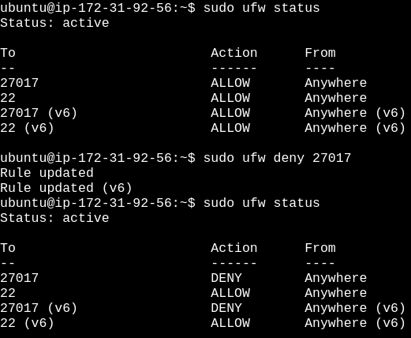

# Práctica 2.2: MongoDB (docker)

## Instalación y Configuración Avanzada de MongoDB

## Configuramos la primera instancia con ubuntu donde lo instalaremos usando Docker

**Verificamos la conectividad entre nuestro host y la MV (mongo-docker):**

`ssh -i /ruta/a/clave .pem (ejem:ubuntu)@ip-pública`

### Instalación de MongoDB usando `Docker`

#### Paso 1: Actualizar los paquetes

`sudo apt update`

#### Paso 2: Instalamos Docker

`sudo apt install docker.io`

#### Paso 3: Descargamos la imagen de MongoDB desde Docker Hub

`sudo docker pull mongo`

#### Paso 4: Creamos y ejecutamos un contenedor con MongoDB

`sudo docker run --name nombre-contenedor -d -p 27017:27017 mongo`

**Este comando nos creará un contenedor en segundo plano con el nombre `nombre-contenedor`, asignado el puerto 27017 del host al contenedor**

#### Paso 5: Verificamos que el contenedor está en ejecución

`docker ps`

#### Paso 6: Acceder al cliente de MongoDB dentro del contenedor

**Podemos abrir una terminal dentro del contenedor y veriricar que MongoDB funciona:**

`docker exec -it 'nombre-contenedor' mongosh`

**Si el cliente de MongoDB se abre y muestra la conexión correcta, significa que MongoDB se nos está ejecutando correctamente en el contenedor.**

## Cambio del puerto de MongoDB

### Paso 1: Detener y eliminar el contenedor de MongoDB actual que ya está ejecutándose

`docker stop 'nombre-contenedor'`

`docker rm 'nombre-contenedor'`

#### Paso 2: Crear un Nuevo Contenedor con el Puerto Cambiado

**Vamos a crear un nuevo contenedor y especificar un puerto diferente al predeterminado (por ejemplo, usaremos el puerto `28000`).**

`docker run -d --name 'nombre-contenedor' -p 28000:27017 mongo`

Aquí hemos indicado que el puerto **28000** de la máquina anfitriona esté asociado al puerto interno **27017** del contenedor, el cual es el puerto que MongoDB usa por defecto dentro del contenedor. MongoDB seguirá escuchando en **27017** dentro del contenedor, pero externamente accederemos mediante **28000**.

#### Paso 3: Verificamos la conexión con el nuevo puerto

`mongosh --port 28000`

## Configuración de la conectividad de red en MongoDB (docker) para NO permitir conexiones remotas

### Paso 1: Iniciamos el contenedor MongoDB sin exponer el puerto en el host

**Ejecuta MongoDB en Docker sin especificar el mapeo del puerto (evitando -p 27017:27017):**

`docker run -d --name 'nombre-contenedor' mongo`

Esto hará que MongoDB esté disponible solo dentro del contenedor y no sea accesible desde otras máquinas

**Verificamos el estado del contenedor para confirmar que está en ejeución, pero sin puertos espuestos**

En la columna `PORTS`, deberemos ver que no se muestra ningún puerto para `otro-contenedor`, indicando que no hay acceso al puerto `27017` desde el exterior del contenedor

Para configurar MongoDB en Docker y no permitir conexiones remotas, debemos ajustar la configuración de MongoDB para que escuche solo en la interfaz localhost (127.0.0.1). Esto garantiza que MongoDB acepte conexiones únicamente desde la misma máquina anfitriona o desde el propio contenedor.

#### Ejecutaremos MongoDB en Docker con la configuración de localhost

Con la imagen que tenemos de MongoDB de Docker, crearemos un contenedor que use el archivo de configuración mongod.conf o directamente especificar la IP de 127.0.0.1.

**Especificaremos bindIp directamente en el comando de inicio**

`docker run -d --name <nombre-contenedor> -p 127.0.0.1:27017 mongo --bind_ip 127.0.0.1`

**Usaremos un firewall (ufW) para bloquear el acceso externo**

- Habilitamos el firewall
    `sudo ufw enable`

- Bloqueamos cualquier acceso externo al puerto 27017
    `sudo ufw deny 27017`

- Confirmamos que las reglas se han aplicado correctamente
    `sudo ufw status`

**Verificamos que MongoDB no sea accesible externamente**

**NO PODEMOS ACCEDER**

## Gestión de cuentas de usuario y permisos

#### Creamos un usuario en MongoDB (docker) que tenga permiso para conectarse desde la otra máquina

`docker exec -it <nombre-contenedor mongosh`

`test> use admin`

`db.createUser({user: "admin_user", pwd: "securePassword", roles: [ { role: "root", db: "admin" } ]});`

## Verificación de la conectividad entre máquinas

- Nos conectamos desde la MV-AWS (docker) a la MV-AWS (apt)

- Desde el HOST a la MV-AWS (apt)

