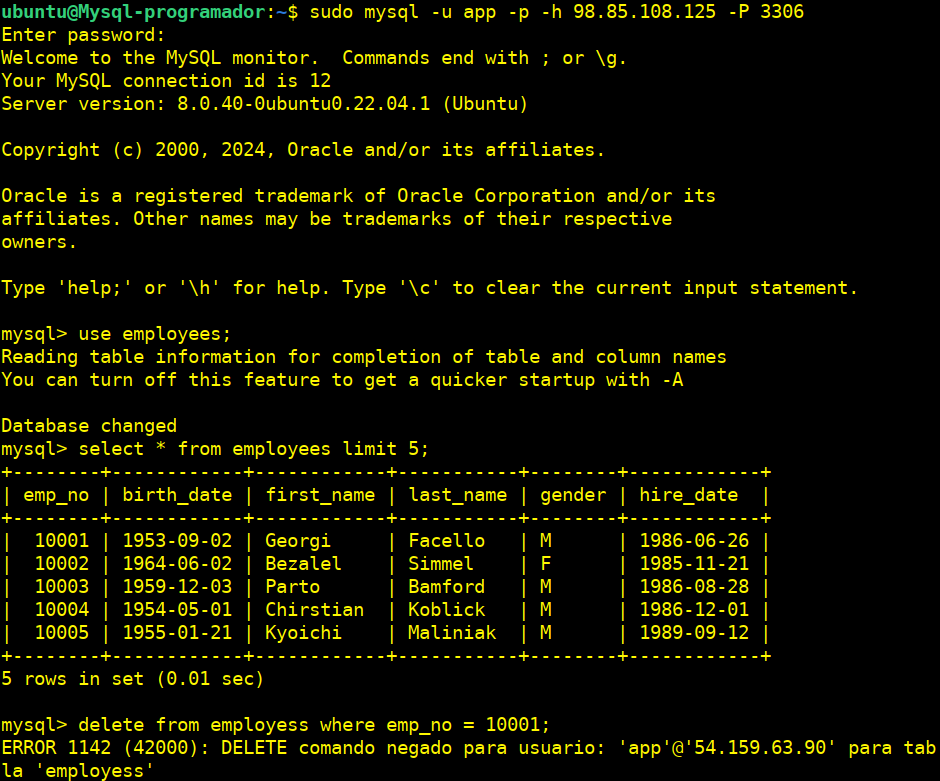
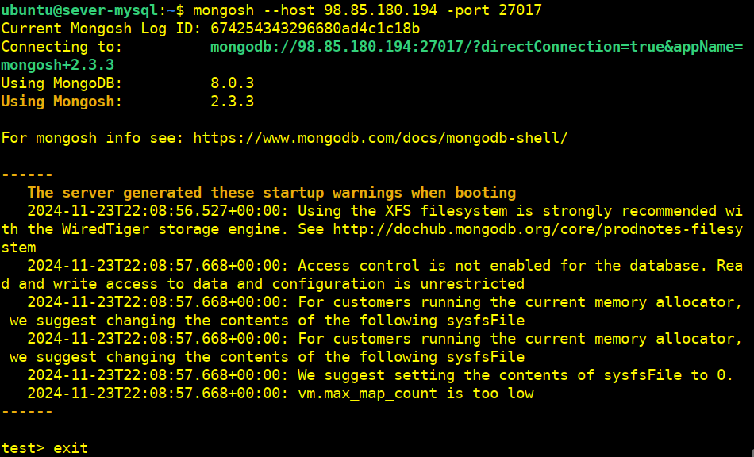
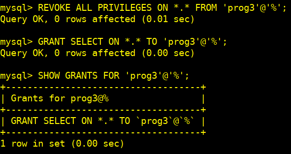

# Examen-22-11-24

## 1.- Máquina 2 (server-mysql)

### Cambiamos el "prompt" del terminal y instalamos el mysql-server

`sudo hostnamectl set-hostname sever-mysql`

`sudo apt update`

`sudo apt dist-upgrade -y`

`sudo apt autoremove`

`sudo apt install mysql-server -y`

`sudo systemctl status mysql`

**Para permitir que MySQL acepte conexiones desde cualquier IP, necesitamos modificar el archivo de configuración de MySQL, específicamente el parámetro `bind-address`**

**Accedemos al Archivo de Configuración de Mysql: `/etc/mysql/mysql.conf.d/mysqld.cnf`**

`sudo nano /etc/mysql/mysql.conf.d/mysqld.cnf`

* **Modificamos el parámetro `bind-address`**
  
  ```text
    De `bind-address = 127.0.0.1`
    A `bind-address = 0.0.0.0`
    ```

  

* **Configuramos el idioma del servidor a español.**
  
  ```text
  [mysqld]
  lc_messages = es_ES
  ```

  

* **Habilitamos el log de consultas lentas en el mismo fichero de configuración.**

  ```text
  slow_query_log = 1
  long_query_time = 3
  slow_query_log_file = /var/log/mysql/slow.log
  ```

  

* **Configuramos optimizaciones de concurrencia y tablas en memoria.**

  ```text
  innodb_buffer_pool_size = 1G
  innodb_log_file_size = 256M
  tmp_table_size = 64M
  max_heap_table_size = 64M
  ```

  

  `sudo systemctl restart mysql.service`

### Copiamos nuestra BBDD

**Desde nuestro terminal de la MV de AWS donde tenemos instalado mysql:**

`git clone https://github.com/datacharmer/test_db.git`

**Para importar los datos a nuestra instancia de MySQL, cargaremos los datos a través de la herramienta de línea de comandos mysql:**

`cd test_db`

`sudo mysql -t < employees.sql`

**En el server-mysql (Máquina 2) creamos los usuario que vamos a utilizar en el proyecto.**

`sudo mysql -u root`

`CREATE USER 'admin1'@'%' IDENTIFIED BY 'Root_pass1';`

`CREATE USER 'prog1'@'%' IDENTIFIED BY 'Root_pass1';`

`CREATE USER 'prog2'@'%' IDENTIFIED BY 'Root_pass1';`

`CREATE USER 'prog3'@'%' IDENTIFIED BY 'Root_pass1';`

`CREATE USER 'app'@'54.159.63.90' IDENTIFIED BY 'Root_pass1';`

**Permitir hacer de todo y administrar permisos.**

`GRANT ALL PRIVILEGES ON *.* TO 'admin1'@'%' WITH GRANT OPTION;`

`GRANT ALL PRIVILEGES ON *.* TO 'prog1'@'%' WITH GRANT OPTION;`

`GRANT CREATE USER ON *.* TO 'admin1'@'%';`

`GRANT CREATE USER ON *.* TO 'prog1'@'%';`

**Permitir hacer de todo.**

`GRANT ALL PRIVILEGES ON *.* TO 'prog2'@'%';`

`GRANT ALL PRIVILEGES ON *.* TO 'prog3'@'%';`

**Damos al usuario `app` acceso limitado.**

`GRANT SELECT ON *.* TO 'app'@'54.159.63.90';`

**Comprobamos todos los usuarios creados.**

`SELECT user, host from mysql.user;`


## 2.- Máquina 1 (mysql-programador)

### Cambiamos el "prompt" del terminal y instalamos el cliente mysql

`sudo hostnamectl set-hostname Mysql-programador`

`sudo apt update`

`sudo apt dist-upgrade -y`

`sudo apt autoremove`

`sudo apt install mysql-client -y`

### Configuramos el acceso para el usuario "app"

**Probar conexión desde el mismo server-mysql con el usuario `app`.**

`sudo mysql -u app -p`


No podemos ya que el usuario `app` solo se puede conectar desde la **Máquina1**

**Usuario "app" con solo permisos de lectura y desde la Máquina 1 (si tiene permiso de conexión) intente borrar de la BBDD:**



**El "prog1" puede entrar y borrar un registro de la BBDD:**


**El "prog2" puede entrar y borrar un registro de la BBDD:**


**El "prog3" puede entrar y borrar un registro de la BBDD:**


**Con el usuario "prog1" puede quitar y cambiar los permisos del usuario "prog2".**


## 3.- Máquina 3

### Cambiamos el "prompt" del terminal e instalamos "docker"

`sudo hostnamectl set-hostname server-docker`

`sudo apt update`

`sudo apt dist-upgrade -y`

`sudo apt autoremove`

`sudo apt install -y apt-transport-https ca-certificates curl software-properties-common`

`curl -fsSL https://download.docker.com/linux/ubuntu/gpg | sudo gpg --dearmor -o /usr/share/keyrings/docker-archive-keyring.gpg`

`echo "deb [arch=$(dpkg --print-architecture) signed-by=/usr/share/keyrings/docker-archive-keyring.gpg] https://download.docker.com/linux/ubuntu $(lsb_release -cs) stable" | sudo tee /etc/apt/sources.list.d/docker.list > /dev/null`

`sudo apt update`

`sudo apt install -y docker-ce docker-ce-cli containerd.io`

`sudo systemctl start docker`

`sudo usermod -aG docker $USER`

### Descargamos e iniciamos un "contenedor mysql"

**Descarga la imagen oficial de MySQL:**

`sudo docker pull mysql:latest`

`sudo docker run --name mysql-docker -e MYSQL_ROOT_PASSWORD=Root_pass1 -d mysql:latest`

**Comprobamos.**

`sudo docker ps`
`sudo docker exec -it mysql-docker mysql -u root -p`

**Vemos que nos podemos conectar desde la misma Máquina de docker:**


**Desde la Máquina del programador NO.**

`mysql -h 98.85.175.167 -u root -p`


## 4.- Máquina 4

### Cambiamos el "prompt" del terminal e instalamos "Mongo"

`sudo hostnamectl set-hostname server-mongo`

`sudo apt update`

`sudo apt dist-upgrade -y`

`sudo apt autoremove`

`sudo apt install gnupg curl`

`curl -fsSL https://www.mongodb.org/static/pgp/server-8.0.asc | sudo gpg -o /usr/share/keyrings/mongodb-server-8.0.gpg --dearmor`

**Para Ubuntu 22.04.**

`echo "deb [ arch=amd64,arm64 signed-by=/usr/share/keyrings/mongodb-server-8.0.gpg ] https://repo.mongodb.org/apt/ubuntu jammy/mongodb-org/8.0 multiverse" | sudo tee /etc/apt/sources.list.d/mongodb-org-8.0.list`  

`sudo apt update`

`sudo apt install -y mongodb-org`

`sudo systemctl start mongod`

`mongosh`


**Editamos el archivo de configuración de MongoDB "/etc/mongod.conf" para permitir solo conexiones desde cualquier máquina.**

Pero ésta debe tener instalado `mongosh`

`sudo nano /etc/mongod.conf`

`bindIp: 0.0.0.0`


`sudo systemctl restart mongod.service`

**Comprobamos desde la Máquina 2.**

`mongosh --host 98.85.180.194 -port 27017`



## Cambios en caliente para el Black Friday

### Reducimos el tiempo de conexión a 5 minutos

#### Ajustamos los parámetros en caliente mediante los siguientes comandos

**Nos conectamos al servidor-mysql como administrador.**

`mysql -u admin1 -p`

`SET GLOBAL wait_timeout = 300;`

`SET GLOBAL interactive_timeout = 300;`


**Pero estas no funcionan en caliente, ya que si las comprobamos vemos que para que se apliquen tendríamos que hacerlas en el fichero `sudo nano /etc/mysql/my.cnf`**

**Comprobamos.**

`SHOW VARIABLES LIKE 'wait_timeout';`


`SHOW VARIABLES LIKE 'interactive_timeout';`


**Este parámetro parecer ser que no prevalece el cambio en caliente por lo que a lo mejor se deduce que para que se apliquen los cambios se tiene que hacer en el fichero de configuración.**

Estos valores permanecerán activos mientras el servidor esté en ejecución. Para que sean permanentes, deberemos actualizar el archivo de configuración más adelante cuando sea posible reiniciar el servidor.

#### Registraremos todas las consultas sin reiniciar el servidor

**Habilitamos el registro general:**

`SET GLOBAL general_log = 'ON';`

**Define el archivo donde se almacenarán las consultas si no está configurado:**

`SET GLOBAL general_log_file = '/var/log/mysql/general.log';`


**Comprobamos.**

`SHOW VARIABLES LIKE 'general_log';`


`SHOW VARIABLES LIKE 'general_log_file';`


**Si queremos monitorear las consultas.**

`tail -f /var/log/mysql/general.log`

**Desactivaremos el log general después del evento para evitar un crecimiento innecesario del archivo:**

`SET GLOBAL general_log = 'OFF';`


**Comprobamos.**

`SHOW VARIABLES LIKE 'general_log';`


#### Cambiamos los permisos del programador "prog3"

Los permisos de un usuario pueden modificarse en caliente sin reiniciar el servidor:

**Accedemos como administrador:**

`mysql -u admin1 -p`

**Revocamos todos los permisos de "prog3":**

`REVOKE ALL PRIVILEGES ON *.* FROM 'prog3'@'%';`

**Otorgamos permisos SELECT  (lectura) únicamente:**

`GRANT SELECT ON *.* TO 'prog3'@'%';`

**Comprobamos.**

`show grants for 'prog3'@'%';`



#### Eliminar al programador "prog2"

**Accedemos como administrador:**

`mysql -u admin1 -p`

**Borramos al usuario "prog2" y lo comprobamos:**

`DROP USER 'prog2'@'%';`

`select user, host from mysql.user;`


