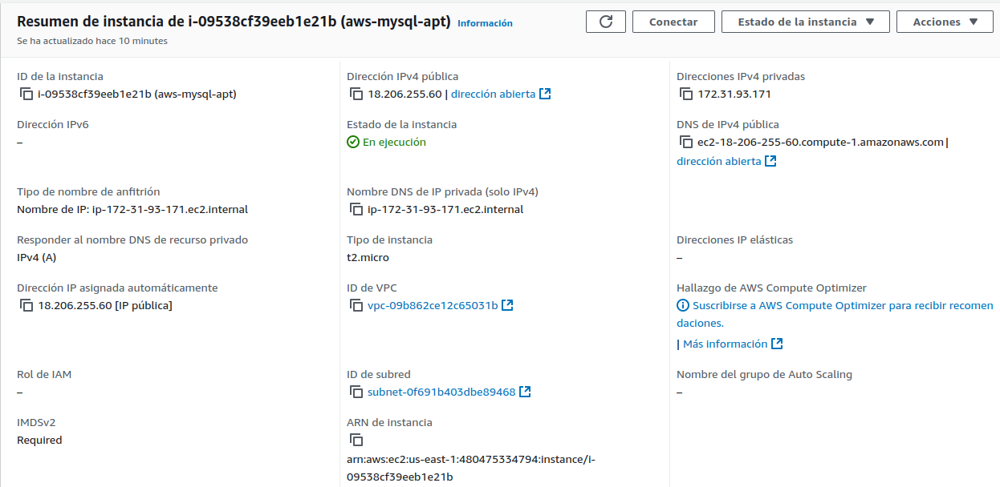
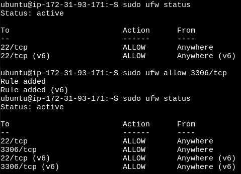

##  PARTE 1: Configuramos en AWS con ubuntu y mysql (con apt install) 

### Configuramos el acceso desde el host por ssh primero al equipo ubuntu y a mysql desde éste:

## Instalamos Mysql

`sudo apt update`

`sudo apt dist-upgrade -y`

`sudo apt install mysql-server -y`

### Configuramos contraseña para el usuario root:

`sudo su`

`select user, host, plugin from user;`

`alter user 'root'@'localhost' identified with caching_sha2_password by 'contraseña';`

`flush privileges;`

### Accedemos al archivo de configuración para permitir conexiones remotas modificando la opción:

**bind-address: 0.0.0.0**

`sudo nano /etc/mysql/mysql.conf.d/mysqld.cnf`

### Reiniciamos mysql:

`sudo systemctl restart mysql.service`

**Comprobamos los puertos que tenemos abiertos en el firewall ufw y habilitamos el puerto 3306:**

`sudo ufw status`

`sudo ufw allow 3306`

**Creamos un usuario para podernos conectar desde cualquier IP y le damos permisos:**

`create user 'usuario'@'%' identified by 'contraseña';`

`grant all privileges on *.* to 'usuario'@'%';`

`flush privileges;`

`select user, host, from mysql.user;`

### Ajustamos reglas del Grupo de Seguridad en AWS (MySQL en puerto 3306):

**Que lo tenemos indicado en el resumen inicial de la instancia.**
**Asignar los permisos en el host para el fichero de la clave .pem:**

`sudo chmod 400 /ruta del fichero.pem`

**Conectamos por ssh a la MV AWS:**

`ssh -i /ruta/a/tu-clave.pem ubuntu@<DNS de IPv4 pública> (resumen de la instancia)`

**Utilizamos el usuario que hemos creado para podernos conectar desde cualquier IP:**

## PARTE 2: Vamos a crear una instancia en AWS EC2

### Donde podamos ejecutar MySQL Server en un contenedor Docker y acceder desde nuestro host local a través del puerto 3307:

**Accedemos al grupo de seguridad y editamos las reglas para agregar una y poder abrir el puerto 3306 (mysql) y 3307/tcp para permitir el acceso a éste desde nuestro host:**

**Conectamos y verificamos que la tenemos actualizada:**

`sudo apt update && sudo apt dist-upgrade -y`

**Instalamos Docker**

`sudo apt install docker.io`

**Nos aseguramoa que docker está en ejecución**

**Reiniciamos**

`sudo reboot`

**Descargamos la imagen de mysql**

`docker versión`

`sudo docker pull mysql:latest`

**Una vez tengamos descargada la imagen, iniciaremos el contenedor de MySQL y mapearemos el puerto 3307 de la instancia EC2 al puerto 3306 del contenedor:**

`sudo docker run -d --name nombre-del-contenedor -e MYSQL_ROOT_PASSWORD=contraseña -p 3307:3306 mysql`

**Con esto hacemos lo siguiente**

    • -d: Ejecutamos el contenedor en modo separado .
    • --name mysql-contenedor : Asigna un nombre al contenedor.
    • -e MYSQL_ROOT_PASSWORD=mi_contraseña: Establecemos la contraseña del usuario root de MySQL.
    • -p 3307:3306: Mapeamos el puerto 3307 de la instancia EC2 al puerto 3306 del contenedor MySQL.

**Verificamos**

`sudo docker ps`

**Nos conectamos desde nuestro host a la instancia de AWS-docker-mysql por medio de la IP publica de ésta y por el puerto 3307:**

`mysql -u root -p -h ip-pública -P 3307`

`select user, host, from mysql.user;`

