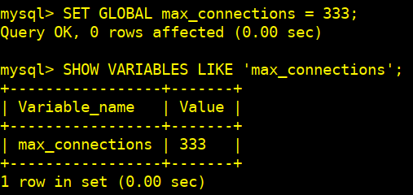
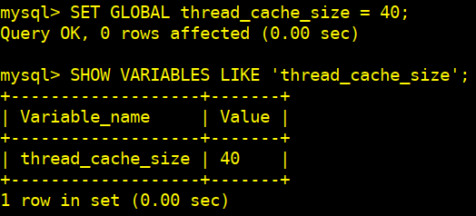

# Práctica 4: Administración y Fine-Tuning del Servidor MySQL

## 1 - Configuración inicial

`sudo apt update`

`sudo apt install mysql-server -y`

`sudo systemctl status mysql`

 Habilitamos MySQL para que se inicie automáticamente al arrancar el sistema:

`sudo systemctl enable mysql`

### 1.2 - Configuramos la conectividad en red

`sudo nano /etc/mysql/mysql.conf.d/mysqld.cnf`

Esto nos permite que MySQL acepte conexiones desde cualquier dirección IP.
Guardamos y reiniciamos mysql

`sudo systemctl restart mysql`

### 1.3.- Configuramos una regla de seguridad para permitir el tráfico en el puerto 3306 (MySQL)

### 1.4 - Establecemos la contraseña inicial para root

`sudo mysql -u root`

`alter user 'root'@'localhost' identified with mysql_native_password BY 'contraseña';`

`flush privileges;`

`exit`

### 1.5 - Creamos un nuevo usuario con acceso desde cualquier IP y le otorgarmos permisos

`mysql -u root -p`

`create user 'nuevo_usuario'@'%' identified by 'contraseña';`

`grant all privileges on *.* TO 'nuevo_usuario'@'%';`

`flush privileges;`

`exit`

### 1.6 - Verificamos la conectividad remota

Probaremos la conexión desde otra máquina usando el cliente MySQL creado:

`mysql -u nuevo_usuario -p -h <ip-del-servidor> -P 3306`

### 1.7 - Aseguramos las cuentas de administración

`sudo mysql_secure_installation`

## 2 - Modificamos la configuración del servidor

### 2.1 - Verificamos la memoria total disponible en el servidor

`free -h`

`sudo nano /etc/mysql/my.cnf`

`nnodb_buffer_pool_size`

- Ajustamos este parámetro según la memoria disponible en nuestro servidor (70-80% de la memoria total), en nuestro caso hemos aplicado un 70%.
- Dividimos el `buffer pool` para mejorar la concurrencia.

#### Guardamos los cambios y reiniciamos MySQL

`sudo systemctl restart mysql`

Comprobamos el estado

`sudo systemctl status myql`

### 2.2 - Verificamos los cambios

`mysql> "SHOW VARIABLES LIKE 'innodb_buffer_pool%';`

## 3 - Activación y configuración de los registros

### 3.1 - Activamos el registro de consultas lentas

- `slow_query_log` : Activa el registro de consultas lentas.
- `long_query_time` : Establece el umbral de tiempo para que una consulta se considere lenta (en segundos).
- `slow_query_log_file` : Define la ubicación y el nombre del archivo donde se guardarán las consultas lentas.

### 3.2 - Activamos el registro de consultas lentas

`SET GLOBAL slow_query_log = 'ON';`

### 3.3 - Establecemos un umbral de tiempo de 2 segundos para considerar una consulta como lenta

#### Previamente editamos este fichero para establecer el valor persistente a 2 segundos

`sudo nano /etc/mysql/mysql.conf.d/mysqld.cnf`

Descomentamos el valor en **[mysqld]**

Guardamos y reiniciamos mysql

`sudo systemctl restart mysql`

#### Ya en mysql

`SET GLOBAL long_query_time = 2;`

### 3.4 - Activamos el registro general y definimos la ruta del archivo de registro

`SET GLOBAL slow_query_log_file = '/var/log/mysql/slow_query.log';`

### 3.5 - Verificamos

`SHOW VARIABLES LIKE 'slow_query_log'`

`SHOW VARIABLES LIKE 'long_query_time';`

`SHOW VARIABLES LIKE 'slow_query_log_file';`

### 3.5 - Documentamos cómo activar y desactivar estos registros en caliente

`SET GLOBAL slow_query_log = ON;`

`SET GLOBAL slow_query_log = OFF;`

## 4 - Gestión de las conexiones y de los hilos

### 4.1 - Ajustamos el número máximo de conexiones concurrentes para garantizar un rendimiento óptimo

En este ejemplo hemos configurado un ajuste de 333 y luego lo hemos comprobado:

Si quisiermoa que este cambio fuera persistente después de un reinicio, editaríamos el fichero de configuración:

`sudo nano /etc/mysql/mysql.conf.d/mysqld.cnf`

`[mysqld]`

`max_connections = xxx`

Descomentaríamos el valor, guardando el cambio y reiniciando se servicio:
`sudo systemctl restart mysql`

### 4.2 - Configuramos el tiempo de espera de las conexiones para evitar saturaciones del sistema

El parámetro `wait_timeout` define el tiempo en segundos que MySQL esperará antes de cerrar una conexión inactiva.

- `wait_timeout` : Se aplica a las conexiones no interactivas (por ejemplo, conexiones abiertas por aplicaciones web).
- `interactive_timeout` : Se aplica a las conexiones interactivas (por ejemplo, sesiones en la consola MySQL)

#### En caliente, de manera temporal

`SET GLOBAL wait_timeout = 600;`  -- 10 minutos

`SET GLOBAL interactive_timeout = 360;`  -- 6 minutos

#### Permanentemente

`sudo nano /etc/mysql/mysql.conf.d/mysqld.cnf`

`[mysqld]`

`wait_timeout = 300`

`interactive_timeout = 300`

`sudo systemctl restart mysql`

**Apreciación:** Valores muy bajos pueden cerrar conexiones antes de que se completen las operaciones, mientras que valores muy altos pueden llevar a una saturación de conexiones inactivas.

### 4.3 - Gestionamos el número de hilos disponibles para garantizar una correcta concurrencia

Ajustar el número de hilos disponibles puede mejorar la concurrencia, especialmente en sistemas con muchos núcleos.

- `thread_cache_size` : Define cuántos hilos se mantendrán en caché para ser reutilizados, reduciendo la sobrecarga de creación de hilos.

#### En caliente, temporalmente

#### De manera constante

`sudo nano /etc/mysql/mysql.conf.d/mysqld.cnf`

`[mysqld]`

`thread_cache_size = 50`

`sudo systemctl restart mysql`

- `innodb_thread_concurrency` : Limita el número de hilos que pueden acceder simultáneamente al motor de almacenamiento InnoDB.

#### En caliente, momentáneamente

#### De manera fija

`sudo nano /etc/mysql/mysql.conf.d/mysqld.cnf`

`[mysqld]`

`innodb_thread_concurrency = 6`

`sudo systemctl restart mysql`

## 5 - Configuración de la memoria caché

### 5.1 - Configura la memoria caché de tablas y consultas para mejorar la eficiencia de las operaciones

#### En caliente, de momento

#### De manera estable

`sudo nano /etc/mysql/mysql.conf.d/mysqld.cnf`

`[mysqld]`

Número máximo de descriptores de tabla abiertos
`table_open_cache = 2000`

Número máximo de definiciones de tabla que se pueden mantener en caché
`table_definition_cache = 1500`

Documenta los ajustes realizados y sus efectos en el rendimiento.
