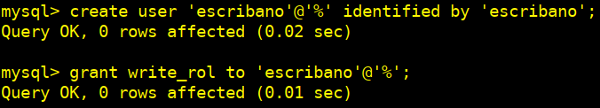
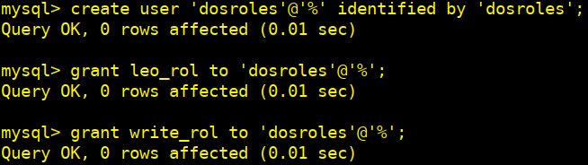
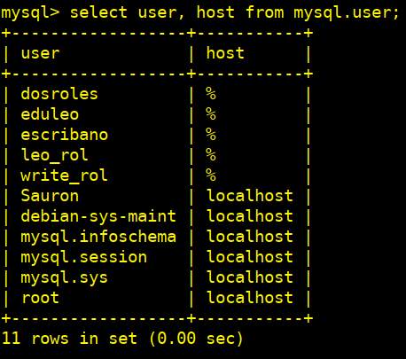
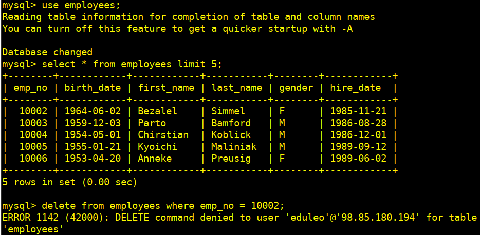
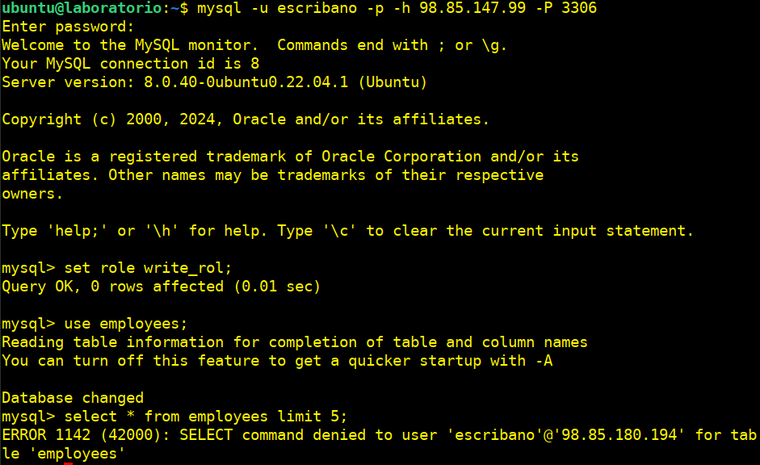
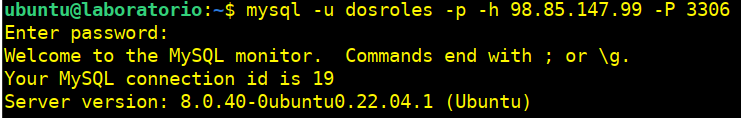

# Práctica tema 4. Usuarios, permisos y roles

## Instalación

* Configuraremos una MV en AWS una con la instalación de mysql-server con la BBDD de tatoo (master).
* Otra MV con mysql-client (laboratorio)
  
### MV-AWS para la BBDD

### MV-laboratorio

**Para permitir que MySQL acepte conexiones desde cualquier IP, necesitamos modificar el archivo de configuración de MySQL, específicamente el parámetro `bind-address`**

1.- Accedemos al Archivo de Configuración de Mysql: `/etc/mysql/mysql.conf.d/mysqld.cnf`

`sudo nano /etc/mysql/mysql.conf.d/mysqld.cnf`

2.- Modificamos el parámetro `bind-address`

De `bind-address = 127.0.0.1`
A `bind-address = 0.0.0.0`

`sudo systemctl restart mysql.service`

### Copiamos nuestra BBDD

Desde nuestro terminal de la MV de AWS donde tenemos instalado mysql:

`git clone https://github.com/datacharmer/test_db.git`

La base de datos de empleados es compatible con varios motores de almacenamiento diferentes, con el motor InnoDB habilitado de forma predeterminada. Editamos el `employees.sql` archivo y ajustaremos los comentarios para elegir un motor de almacenamiento diferente:

`cd test_db`

`sudo nano employes.sql`

Pero al final no guardamos esta configuración solo la vemos para saber como cambiarla.

Para importar los datos a su instancia de MySQL, cargaremos los datos a través de la herramienta de línea de comandos mysql:

`sudo mysql -t < employees.sql`

### Validación de los datos de los empleados

Puede validar los datos del empleado mediante dos métodos `md5` y `sha`. Se proporcionan dos scripts SQL para este propósito `test_employees_sha.sql` y `test_employees_md5.sql`. Para ejecutar las pruebas, usaremos **mysql**:

`sudo time mysql -t < test_employees_sha.sql`

`sudo time mysql -t < test_employees_md5.sql`

### Creación de un usuario administrador

**1.- Creamos un usuario que tenga todos los permisos sobre esta base de datos y además tenga permiso para otorgar permiso a otros usuarios. Utiliza este usuario para realizar los puntos siguientes.**

`sudo mysql -u root`

`CREATE USER 'Sauron'@'localhost' IDENTIFIED BY 'Root_pass1';`

`GRANT ALL PRIVILEGES ON *.* TO 'Sauron'@'localhost' WITH GRANT OPTION;`

`GRANT CREATE USER ON *.* TO 'Sauron'@'localhost';`

### Comprobamos

`select user, host from mysql.user;`

`mysql -u Sauron -p`

### Creación de dos usuarios

**2.- Creamos dos usuarios que tenga acceso de lectura a todas las tablas de la base de datos. Uno podrá acceder desde cualquier punto y el segundo solo podrá acceder desde la IP del cliente del laboratorio.**

`CREATE USER 'totread'@'%' IDENTIFIED BY 'totread';`

`GRANT SELECT ON employees.* TO 'totread'@'%';`

`CREATE USER 'ipread'@'98.85.180.194' IDENTIFIED BY 'ipread';`

`GRANT SELECT ON employees.* TO 'ipread'@'98.85.180.194';`

**Verificamos los privilegios de los usuarios:**

`SHOW GRANTS FOR 'totread'@'%';`

`SHOW GRANTS FOR 'ipread'@'98.85.180.194';`

**3.- Creamos dos usuario que tenga acceso de lectura/escrituta a todas las tablas de la base de datos. Igual que antes uno solo accederá desde el cliente del laboratorio y el segundo desde cualquier punto.**

`create user 'rwtot'@'%' identified by 'rwtot';`

`GRANT SELECT, INSERT, UPDATE, DELETE ON employees.* TO 'rwtot'@'%';`

`create user 'rwip'@'98.85.180.194' identified by 'rwip';`

`GRANT SELECT, INSERT, UPDATE, DELETE ON employees.* TO 'rwip'@'98.85.180.194';`

**Verificamos los privilegios de los usuarios.**

`SHOW GRANTS FOR 'rwtot'@'%';`

`SHOW GRANTS FOR 'rwip'@'98.85.180.194';`

**Comprobamos los usuarios creados.**

`select user, host from mysql.user;`

**4.- Realizamos las pruebas necesarias para ver que estos usuarios acceden sólo desde donde tienen permiso y que pueden o no pueden modificar la información en función de los permisos otorgados.**

Desde el servidor-laboratorio nos conectamos al servidor de la BBDD employees, seleccionamos esta y dentro 5 empleados e intentamos borrar uno.

`mysql -u totread -p -h 98.85.147.99 -P 3306`

`use employees;`

`select * from employees limit 5;`

`delete from employees where emp_no = 10001;`

**No podemos borrar el registro ya que el usuario `totread` solo tiene permisos de lectura.**

Desde el equipo anfitrión nos intentamos conectar con el usuario que tiene permisos de lectura/escritura desde un IP (host) que no es la que tiene establecida para la conexión.

`mysql -u rwip -p -h 98.85.147.99 -P 3306`

**No podemos autentificar-nos ya que no estamos en la IP que se nos pide en la configuración del usuario para conectarnos.**

Vamos a conectarnos con el usuario que si tiene permisos de lectura/escritura:

**Si que hemos podido borrar ya que el usuario user-rw1 si tiene permisos de lectura y escritura, además de poderse conectar desde cualquier punto.**

**5.- Eliminamos las cuentas creadas en los puntos 2 y 3.**

`mysql -u Sauron -p`

`drop user 'totread'@'%';`

`drop user 'rwtot'@'%';`

`drop user 'ipread'@'98.85.180.194';`

`drop user 'rwip'@'98.85.180.194';`

`select user, host from mysql.user;`

### Creación de roles

**1.- Creamos un rol que otorgue permisos de lectura sobre todas las tablas de la
base de datos.**

`create role leo_rol;`

`grant select on employees.* to leo_rol;`

**2- .Creamos un rol que otorgue permisos de escritura sobre todos las tablas de la base de datos.**

`create role write_rol;`

`grant insert, update, delete on employees.* to write_rol;`

**3.- Creamos un usuario y le asignamos el rol de lectura.**

`create user 'eduleo'@'%' identified by 'eduleo';`

`grant leo_rol to 'eduleo'@'%';`

**4.- Creamos un usuario y le asignamos el rol de escritura.**

`create user 'escribano'@'%' identified by 'escribano';`

`grant write_rol to 'escribano'@'%';`

**5.- Creamos un tercer usuario y le asignamos los dos roles.**

`create user 'dosroles'@'%' identified by 'dosroles';`

`grant leo_rol to 'dosroles'@'%';`

`grant write_rol to 'dosroles'@'%';`

**El comando `SET DEFAULT ROLE ALL TO 'leo_rol'@'%', 'write_rol'@'%';` establece los roles predeterminados que se asignarán automáticamente a un usuario cuando inicie sesión en MySQL.**

`set default role all to 'leo_rol'@'%', 'write_rol'@'%';`

**6.- Hacemos las pruebas pertinentes para ver los roles que tiene cada usuario.**

`select user, host from mysql.user;`

**7.- Hacemos las pruebas pertinentes para ver que sólo pueden realizar aquello para los que tienen los roles, desde el server-laboratorio.**

**Accedemos a la BBDD con el usuario que tiene asignado el rol de lectura:**

`mysql -u eduleo -p -h 98.85.147.99 -P 3306`

**Activamos el Rol de Lectura.**

El rol no esté activo para nuestra sesión actual del usuario. Lo activamos manualmente:

`set role 'leo_rol';`

Seleccionamos nuestra BBDD employees y listamos 5 empleados y al intentar borrar uno de ellos nos lo va a denegar ya que el usuario `eduleo` solo tiene permiso de lectura.

`use employees;`

`select * from employees limit 5;`

`delete from employees where emp_no = 10002;`

**Ahora accedemos a la BBDD con el usuario que tiene asignado el rol de escritura.**

**Activamos el Rol de Escritura.**

El rol no esté activo para nuestra sesión actual del usuario. Lo activamos    manualmente:

`set role 'write_rol';`

Seleccionamos nuestra BBDD employees e intentamos listar 5 empleados, pero nos lo va a denegar ya que el usuario `escribano` solo tiene asignados el rol de escritura y no de lectura, por lo que no podemos acceder.

`use employees;`

`select * from employees limit 5;`

**Ahora accedemos a la BBDD con el usuario que tiene asignado los roles lectura/escritura.**

`mysql -u dosroles -p -h 98.85.147.99 -P 3306`

**Activamos los Roles de lectura/escritura.**

Los roles no estarán activos para nuestra sesión actual del usuario. Los activamos manualmente:

`set role 'leo_rol';`

`set role 'write_rol';`

Seleccionamos nuestra BBDD employees e intentamos listar 5 empleados, pero nos lo impide a pesar de tener asignado los dos roles de lectura y escritura, por lo que vamos a generar un nuevo rol `readwr_rol`que integre todos los permisos para así a ver si podemos arreglar esta situación.

**Desde la terminal donde tenemos la BBDD.**

**Accedemos con el usuario administrador `Sauron`:**

 `mysql -u Sauron -p`

Creamos el nuevo rol `readwr-rol`, le damos los permisos de lectura/escritura en un solo comando y se lo asignamos al usuario `dosroles`:

`create role readwr_rol;`

`grant select, insert, update, delete on employees.* to readwr_rol;`

`grant readwr_rol to 'dosroles'@'%';`

**Desde la terminal de nuestro server `laboratorio` accedemos con el usuario `dosroles`**

`mysql -u dosroles -p -h 98.85.147.99 -P 3306`

Como el rol no estará activo para nuestra sesión actual del usuario. Lo activamos manualmente:

`set role 'readwr_rol';`

Seleccionamos nuestra BBDD employees y listamos 5 empleados, y vemos que podemos borrar un usuario ya que además de poder acceder con el rol que contiene `select` también podemos borrar ya que el mismo rol contiene `delete`.

`use employess;`

`select * from employees limit 5;`

`delete from employees where emp_no = 10002;`

`select * from employees limit 5;`

### Conclusiones

**1.- Como administrador de base de datos:**

1. ¿Usarías roles a la hora de administrar un servidor de base de datos?
Si, evitamos otorgar privilegios individualmente a posiblemente muchas cuentas de usuario y
creando roles con nombres para los conjuntos de privilegios requeridos nos facilitará la concesión de los privilegios necesarios a las cuentas de usuario mediante la concesión de los roles adecuados.

2. ¿Qué ventajas ves al uso de roles?
   * Gestionamos los permisos simplificadamente.
   * Controlamos el establecimiento de permisos para mejorar la seguridad.
   * La escalabilidad no nos afectaría ya que los roles asignados en conjunto controlarían ese inconveniente.
   * Mantenimiento más simplificado, al realizar los cambios sobre los roles y no sobre los permisos.
