# Copias de seguridad y sistema de réplica

**En esta práctica, trabajaremos con varias máquinas para gestionar las copias de seguridad (incrementales y completas) y como guardar un sistema de réplica en `MySQL`.**

**`Restricciones`: No se puede utilizar `scp, ftp` ni herramientas similares para transferir datos entre máquinas.**

## Escenario

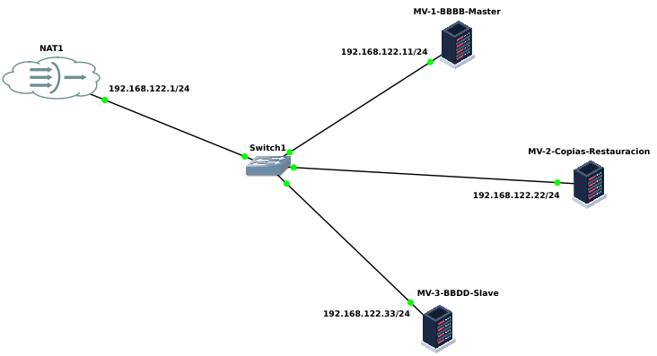

### Máquina 1-Master (Base de datos principal - tattoo)

```text
sudo apt update
sudo apt install mysql-server rsync -y
sudo systemctl enable mysql
sudo systemctl start mysql
```

**Haremos los cambios necesarios en el fichero de configuración para que el servidor principal actúe como maestro (master).**

`sudo nano /etc/mysql/mysql.conf.d/mysqld.cnf`

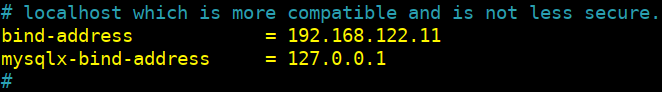

**Restauramos.**

`sudo systemctl restar mysql.service`

**Creamos el usuario "edu1" para el server-master.**

`sudo mysql -u root -p`

`CREATE USER 'edu1'@'%' IDENTIFIED BY '123';`

`select user, host from mysql.user;`


**Una excelente práctica de seguridad y conveniencia es almacenar el usuario y la contraseña de MySQL en un archivo `.my.cnf` para evitar tener que especificarlos explícitamente en la línea de comandos con `-u` y `-p`. Esto previene que las contraseñas se muestren en la pantalla, lo cual es un riesgo de seguridad.**

#### Crearemos el archivo .my.cnf

**Una vez que el usuario está creado y tiene los privilegios necesarios, entonces crearemos el archivo .my.cnf en el directorio home del usuario del sistema y le damos los permisos correspondientes.**

`cd ~`

`sudo nano .my.cnf`

```text
[client]
user=edu1
password=123
```


`sudo chmod 600 .my.cnf`


**Asignamos en esta práctica al nuevo usuario para la BBDD con todos los privilegios.**

`GRANT ALL PRIVILEGES ON tattoo.* TO 'edu1'@'%';`

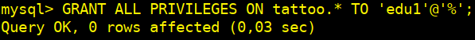

#### Restauramos la BBDD tattoo desde un archivo SQL

`sudo mysql < tattoo.sql`

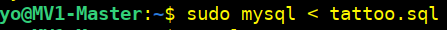

**Comprobamos.**


##### Configuramos acceso SSH desde la Máquina 1 a la Máquina 2

**En la Máquina 1, generamos clave SSH.**

`ssh-keygen -t rsa -b 2048`

`Enter file in which to save the key (/home/yo/.ssh/id_rsa): Enter`

`Enter passphrase (empty for no passphrase): 123`

`Enter same passphrase again: 123`

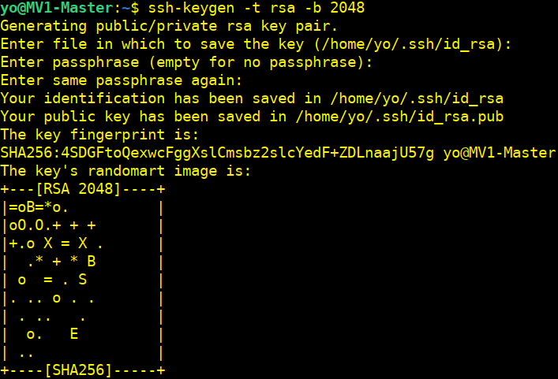

##### Copiamos la clave pública a la Máquina 2

`ssh-copy-id yo@192.168.122.22`

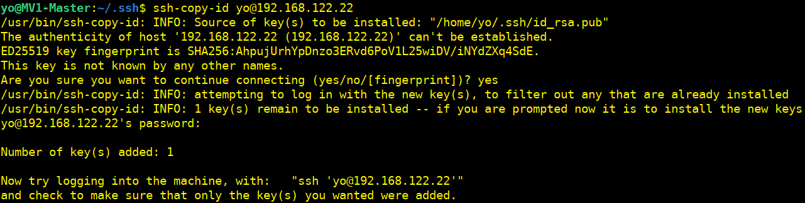

##### Creamos los directorios temporales `home` en la Máquina 1 (master) para almacenar las copias

`mkdir /home/yo/bkptattoo`

`mkdir /home/yo/bkptattoo/incremental`

`mkdir /home/yo/bkptattoo/completa`


### Máquina 2-Server-almacenamiento-restauración

```text
sudo apt update
sudo apt install mysql-server openssh-server rsync gzip -y
sudo systemctl enable mysql
sudo systemctl start mysql
```

`sudo nano /etc/mysql/mysql.conf.d/mysqld.cnf`


**Restauramos.**

`sudo systemctl restar mysql.service`

**Creamos el usuario "edu2" para el server-restauración.**

`sudo mysql -u root -p`

`CREATE USER 'edu2'@'%' IDENTIFIED BY '123';`

`select user, host from mysql.user;`


#### Crearemos en máquina 2 el archivo .my.cnf

`cd ~`

`sudo nano .my.cnf`

```text
[client]
user=edu2
password=123
```

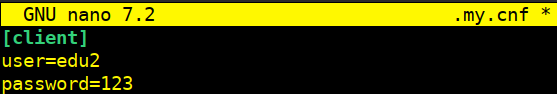

`sudo chmod 600 .my.cnf`


##### Crearemos los directorios en nuestro `home` en la Máquina 2 para las copias

`mkdir /home/yo/bkptattoo`

`mkdir /home/yo/bkptattoo/incremental2`

`mkdir /home/yo/bkptattoo/completa2`


### 1.Configuración de copias de seguridad a la “máquina 1”

#### 1.1.Configuramos las copias incrementales diarias

##### Creamos el script del backup incremental

**Podemos ver el archivo.sh [aquí](script_incremental_sh.md)**

**[Descargar el archivo](script_incremental.sh)**

**Damos permisos de ejecución al script:**

`sudo chmod +x /home/yo/script_incremental.sh`


#### Configuramos la tarea `cron` para ejecutar el script a las 23:00


`crontab -e`

##### Añadimos esta línea al archivo `cron`

`0 23 * * * /home/yo/script_incremental.sh >> /var/log/backup_incremental.log 2>&1`

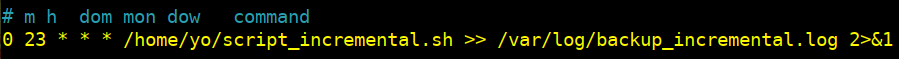

##### Ejecutamos el script de la copias incrementales manualmente para comprobar su funcionamiento

**Usaremos el programa `ssh-agent` para que mantenga las claves privadas en memoria para que no tengamos que ingresar la frase de contraseña cada vez que ejecutemos el script.**

**Iniciamos.**

`eval "$(ssh-agent -s)"`

**Añadimos la calve privada a `ssh-agent`, con lo que nos pedirá la frase de nuestra contraseña.**

`ssh-add /home/yo/.ssh/id_rsa`


**Finalmente ejecutamos nuestro script.**

`./script_incremental.sh`


##### Comprobamos la transferencia a la máquina 2


#### 1.2.Configuramos las copias completas semanales

##### Creamos un script para las copias completas

**Podemos ver el archivo.sh [aquí](script_completa_sh.md)**

**[Descargar el archivo](script_completa.sh)**

**Damos permisos de ejecución al script:**

`sudo chmod +x /home/yo/script_completa.sh`


#### Configuramos la tarea `cron` para ejecutar el script cada domingo a las 23:59

`crontab -e`

##### Añadimos esta nueva  línea al archivo `cron`

`59 23 * * 0 /home/yo/script_completa.sh >> /var/log/backup_completa.log 2>&1`

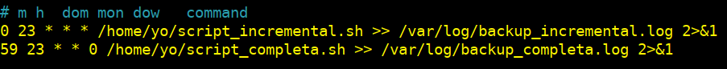

##### Ejecutamos el script de la copias completas semanales manualmente para comprobar su funcionamiento

**Ejecutamos el script, pero antes instalamos `pv`, ya que este comando esta dentro del script.**

`sudo apt install pv -y`

`./script_completa.sh`


##### Comprobamos la transferencia de la copia completa a la máquina 2


**Comprobamos en la imagen anterior que después de la transferencia a la máquina 2 nuestro script nos elimina la copia de la máquina 1 para no tener acumulación de copias completas.**

### 2.Transferimos solo la estructura de la BBDD (máquina 1)

`sudo mysqldump --no-data tattoo > estructura_tattoo.sql`


**Transferimos con `rsync` el archivo a “máquina 2”.**

`rsync -avz estructura_tattoo.sql yo@192.168.122.22:/home/yo/bkptattoo/`


#### 2.1. Verificamos en máquina 2


**En la Máquina 2, restauramos la estructura en MySQL, creando la BBDD previamente.**

`sudo mysql -e "CREATE DATABASE tattoo;"`

`sudo mysql tattoo < /home/yo/bkptattoo/estructura_tattoo.sql`

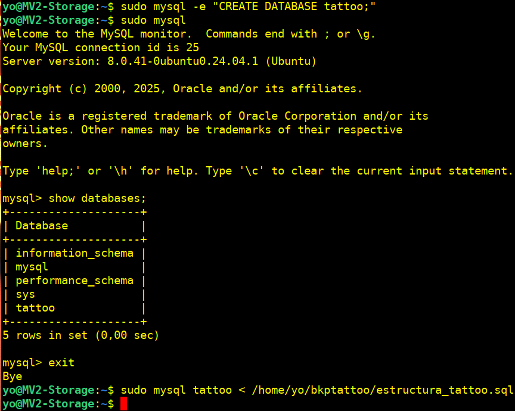

#### 2.2. Verificamos que la estructura se importó correctamente

`sudo mysql`

`use tattoo;`

`show tables;`

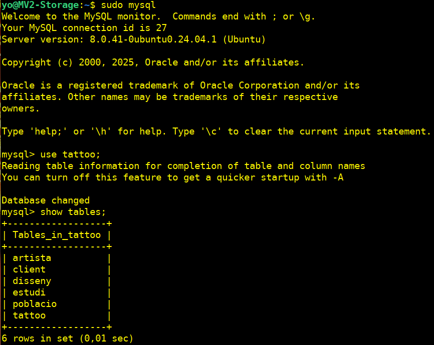

#### 2.3. Realizamos un estudio de la estructura de la BBDD

`DESCRIBE artista;`

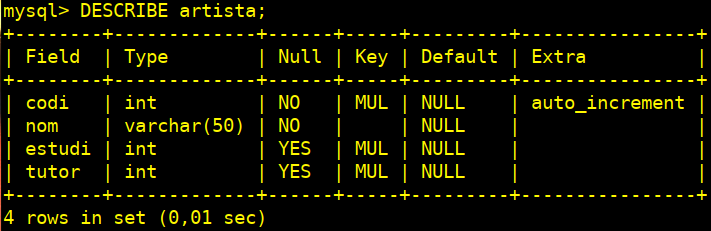

### 3. Transferencia y restauración de datos

#### 3.1. Exportamos solo los datos de la BBDD `tattoo` y los importamos en la "máquina 2" después de una semana

**Desde la máquina 1, ejecutamos:**

`sudo mysqldump --no-create-info tattoo > tattoo_datos.sql`

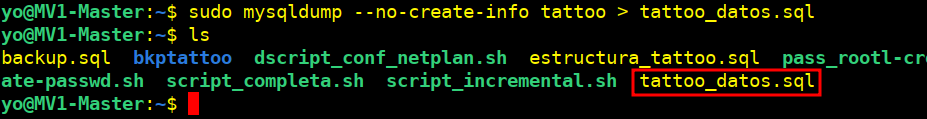

**Transferimos el archivo tattoo_datos.sql usando `rsync`, eliminando el archivo en la máquina de origen después de la transferencia, con  `--remove-source-files`**

`rsync -avz --remove-source-files tattoo_datos.sql yo@192.168.122.22:/home/yo`


**Verificamos la transferencia en la máquina 2.**

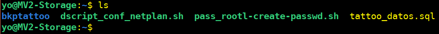

#### 3.2. Añadimos una tabla nueva llamada caja en la "máquina 2"

`sudo mysql`

`use tattoo;`

`CREATE TABLE caja (id INT AUTO_INCREMENT PRIMARY KEY, cantidad INT NOT NULL);`


##### Verificamos la creación de la tabla

`show tables;`

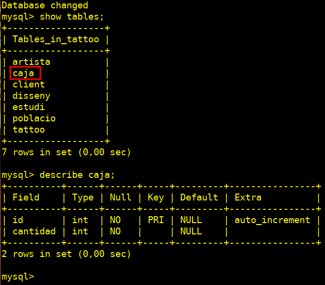

### 4. Recuperamos desde un punto concreto

#### 4.1 Borramos accidentalmente la tabla tattoo en la "máquina 2"

`sudo mysql -e "DROP TABLE tattoo.tattoo;"`


##### Verificamos la eliminación de la tabla `tattoo`

`sudo mysql`

`use tattoo;`

`show tables;`

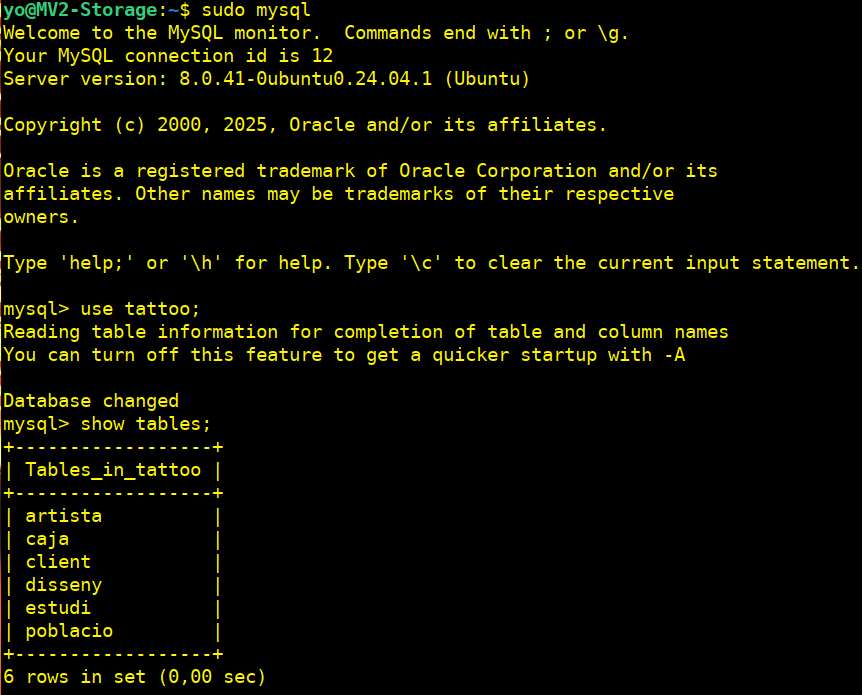

##### 4.2. Recuperaremos la base de datos desde la operación previa al borrado de la tabla

##### 4.2.1.-En la Máquina 2 restauraremos la estructura para que nos de error por la falta de la tabla tattoo que hemos borrado

`sudo mysql tattoo < bkptattoo/estructura_tattoo.sql`


**Comprobamos.**

`sudo mysql`

`show databases;`


##### 4.2.2.-Importamos los datos

`sudo mysql tattoo < /home/yo/tattoo_datos.sql`


## 5. Configuraremos un esclavo en la "máquina 3"

```text
sudo apt update
sudo apt install mysql-server -y
sudo systemctl enable mysql
sudo systemctl start mysql
```

### 5.1 Configuraremos la "máquina 3" como esclavo de la "máquina 1"

#### En la "máquina 1" (`servidor maestro`), haremos los cambios necesarios en el fichero de configuración para que el servidor principal actúe como maestro (master)

**Editaremos el archivo de configuración `/etc/mysql/mysql.conf.d/mysqld.cnf` y añadiremos:**

`sudo nano /etc/mysql/mysql.conf.d/mysqld.cnf`

```sql
[mysqld]
server-id=1
log_bin=/var/log/mysql/mysql-bin.log
binlog_do_db=tattoo
```


**Reiniciamos.**

`sudo systemctl restar mysql.service`

### 5.2 Crearemos en la "máquina 1" un usuario replicador

```sql
sudo mysql
CREATE USER 'replicador'@'%' IDENTIFIED WITH mysql_native_password BY '123';
GRANT ALL PRIVILEGES ON * . * TO 'replicador'@'%';
GRANT REPLICATION SLAVE ON *.* TO 'replicador'@’%';
```


**Comprobamos.**

`SELECT user, host, plugin FROM mysql.user WHERE user='replicador';`

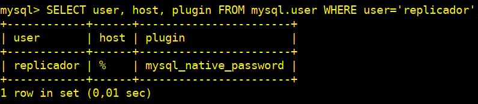

**Cambiamos a “tattoo” y bloqueamos la BBDD para evitar nuevos cambios.**

`show databases;`

`use tattoo;`

`flush tables with read lock;`


**Ejecutamos el siguiente comando para obtener los datos necesarios para la configuración del Esclavo:**

`SHOW MASTER STATUS;`


**Esta es la posición desde la cual la base de datos esclava comenzará a replicarse. Registraremos estos números, pues serán útiles más tarde.**

**Si realizamos nuevos cambios en la misma ventana, la base de datos se desbloqueará automáticamente.**

**Por esta razón, debemos abrir una nueva pestaña o ventana y continuar con los próximos pasos allí.**

#### Haremos una configuración específica para `mysqldump y replicación`

**Si el usuario replicador es utilizado solo para la replicación, podemos definir un bloque específico en el fichero .my.cnf.**

`cd ~`

`sudo nano .my.cnf`

```text
[mysqldump]
user=replicador
password=456
```


**Continuando con la base de datos aún bloqueada, exportaremos la base de datos usando `mysqldump` en la nueva ventana (nos aseguraremos de estar escribiendo este comando en el shell `bash`, no en `MySQL`).**

`sudo mysqldump --opt tattoo > tattoo.sql`


**Volvemos a la ventana original, desbloqueando las BBDD (para que se pueda escribir en ellas de nuevo).**

`unlock tables;`


**Cuando MySQL detecta que la conexión se perdió, intenta reconectarse automáticamente. Después de la reconexión, UNLOCK TABLES se ejecuta sin problemas.**

### 5.3 Copiaremos los datos de la BBDD (maestro) en el servidor réplica y comenzaremos a configurar la BBDD esclava

**Creamos la nueva BBDD que va a replicar del maestro (luego salimos):**

`sudo mysql`

`create database tattoo;`

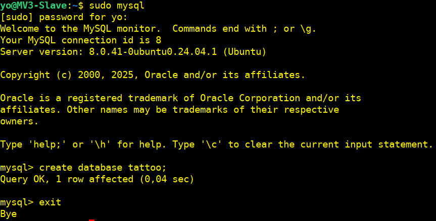

**Transferimos con `rsync` la BBDD del master a la “máquina 3” slave.**

`rsync -avz estructura_tattoo.sql yo@192.168.122.22:/home/yo/bkptattoo/`


**Comprobamos.**

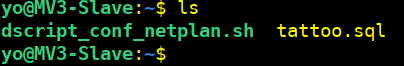

#### Restauramos la BBDD `tattoo` en el slave desde el archivo SQL

`sudo mysql tattoo < tattoo.sql`

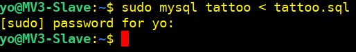

**Comprobamos.**

```sql
sudo mysql
show databases;
use tattoo;
show tables;
```


### 5.4 Ahora configuraremos el Servidor Replica (slave)

**Al igual que en el otro servidor (maestro), hay que configurar el servidor réplica para que conecte con el principal de la misma manera que lo hicimos con el maestro.**

`sudo nano /etc/mysql/mysql.conf.d/mysqld.cnf`

```sql
[mysqld]
server-id=2
relay-log=/var/log/mysql/mysql-relay-bin.log
log_bin=/var/log/mysql/mysql-bin.log
binlog_do_db=tattoo
```

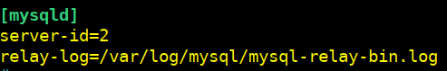

**Reiniciamos.**

`sudo systemctl restar mysql.service`

### 5.5 Inicializamos la replica

**Poner en marcha la réplica. A partir de este momento cualquier cambio realizado en la BBDD en el servidor `maestro` se debe reflejar automáticamente en la `réplica`, por lo que habilitamos la replicación desde el shell de MySQL.**

`sudo mysql`

```sql
CHANGE MASTER TO
    MASTER_HOST='192.168.122.11',
    MASTER_USER='replicador',
    MASTER_PASSWORD='123',
    MASTER_LOG_FILE='mysql-bin.000001',
    MASTER_LOG_POS=895;
```


**Activamos el servidor esclavo:**  

`START SLAVE;`


**Podemos ver los detalles de la replicación esclava escribiendo este comando. El G reorganiza el texto para hacerlo más legible.**

`SHOW SLAVE STATUS\G;`

**Si todo está bien, deberemos ver:**

`Slave_IO_Running: Yes`

`Slave_SQL_Running: Yes`

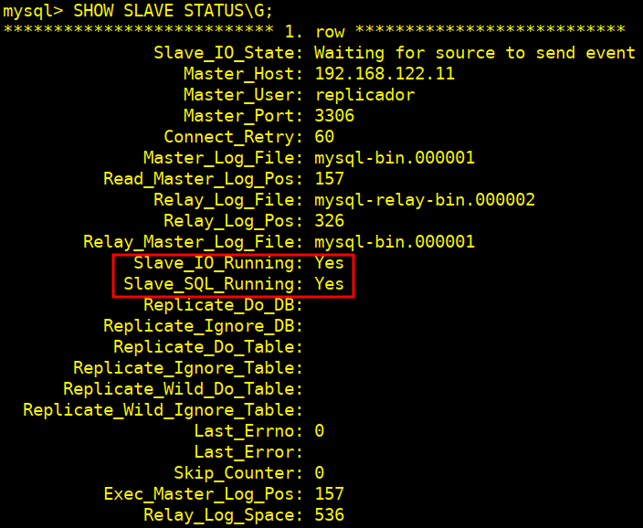


#### 5.6 Vamos a hacer una prueba para comprobar que la replicación se está desarrollando correctamente

**Insertaremos un nuevo cliente en la tabla `client` de nuestra BBDD `tattoo`.**

`sudo mysql`

`show databases;`

`use tattoo;`

`show tables;`

`describe client;`


`SELECT * FROM client ORDER BY codi DESC LIMIT 5;`


`INSERT INTO client (nom, cp) VALUES ('Sebastian Ciscar', '46760');`

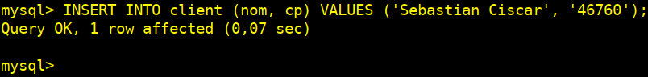

**Verificamos la inserción en el maestro:**

`SELECT * FROM client WHERE nom = 'Sebastian ciscar';`


#### 5.7 Nos conectamos en el servidor slave para comprobar la replica

`sudo mysql`

`use tattoo;`

`SELECT * FROM client ORDER BY codi DESC LIMIT 5;`

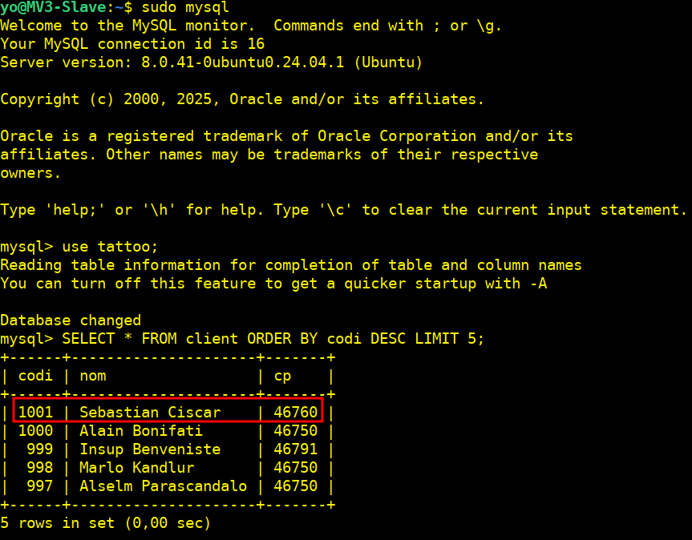

### Con esto, la replicación estará funcionando correctamente
